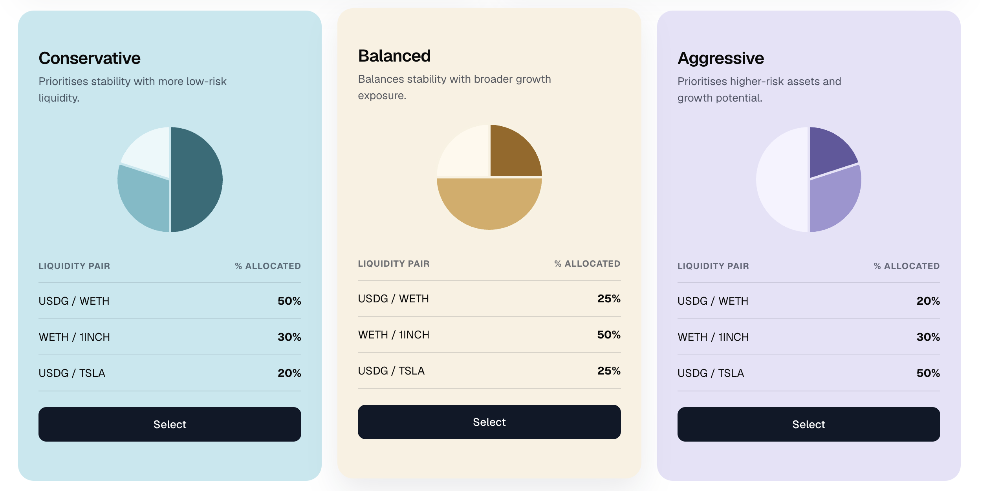
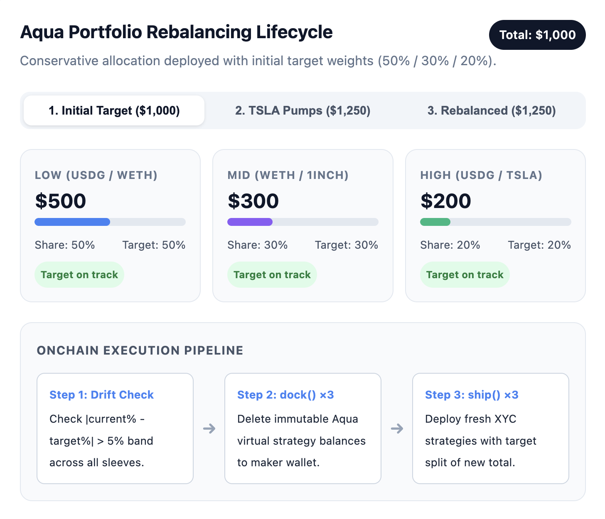

# Aqua Funds Manager - Submission for Eth Global Online Hackathon 2026

> - **Project name:** 💧 Aqua Funds Manager
> - **🔗 Live Demo URL:** [https://eth-global-online-hackathon-2026.cavallerajean.workers.dev/](https://eth-global-online-hackathon-2026.cavallerajean.workers.dev/)



## Project Overview

💧 Aqua Funds Manager is an app allowing liquidity providers on  on **Robinhood** 🪶 to allocate their liquidity differently across AMM pools depending on their risk tolerance and the risk profile they selected.

- Built on 💧 1inch Aqua 
- 3 x risk profiles (**🟦 Conservative**, **🟧 Balanced**, **🟪 Aggressive**) with pre-defined % fund allocations.
- Creates concentrated liquidity strategies as `AquaXYCAmmStrategy` + swap vm programs.
- 3 x liquidity pools for `USDG`, `WETH`, `1INCH`, and `TSLA` tokenized stock.
- Built as a mainnet fork of **Robinhood** 🪶

The integration with 1inch is built in a way to act like a _"portfolio manager and rebalancer"_. When asset prices move more or less than 5% (_e.g: TSLA stock price goes up and pump📈!_), it re-allocate and re-balance funds across the pools.

**🎯 Goal and rationale:** keep the funds allocated in proportions to the risk profile and percentage allocations that the liquidity provider had selected.

**Tech Stack:**
- ⚒️ 1inch Aqua + Swap VM SDK, from [`@1inch/aqua-sdk`](https://github.com/1inch/sdks/tree/master/typescript/aqua) and [`@1inch/aqua-swap-vm`](https://github.com/1inch/sdks/tree/master/typescript/swap-vm)
- ⛓️ anvil fork of Robinhood mainnet running locally via a chain state snapshot
- 💻 Next.js for the UI

### Liquidity & Risk profiles explained

3 investment risk profiles can be used on Robinhood network:
- **🟦 Conservative**
- **🟧 Balanced**
- **🟪 Aggressive**

| Sleeve    | Pair (Robinhood)   | 🟦 Conservative | 🟧 Balanced | 🟪 Aggressive |
|-----------|----------------------------|--------------|----------|------------|
| Low risk  | USDG / WETH        | 50%          | 25%      | 20%        |
| Medium risk  | WETH / 1INCH       | 30%          | 50%      | 30%        |
| High risk | USDG / TSLA | 20%          | 25%      | 50%        |

To illustrate, a user wanting to provide 1,000$ in liquidity in total who picks the **Conservative** risk profile → will allocate 50% of its liquidity budget to USDG/WETH ≈ $500

| Token | Amount | ~$ (your 1 ETH = $2,500) |
|---|---|---|
| USDG | 250 (6 decimals) | $250 |
| WETH | 0.1 | $250 |
| **Sleeve** | | **$500 = 50%** |


---

### 1inch Aqua + Swap VM - details on implementation

This demo uses `@1inch/aqua-sdk` and `@1inch/swap-vm-sdk` in the following three ways.

1. It interacts with the official 1inch Aqua and Swap VM contract addresses deployed on Robinhood (_note: through mainnet fork_), imported

2. The `@1inch/aqua-sdk` is used to build each 3 x strategies. The amounts allocated to each strategy varies depending on the risk profile the user chose (**Conservative** _vs_ **Balanced** _vs_ **Aggressive**). 

3. The `@1inch/swap-vm-sdk` is used to build the concentrated liquidity program.
      - It uses `AquaXYCAmmStrategy.newConcentrate(...)` to create a concentrated liquidity in a price range equivalent to the `-5% < asset price < +5%`.
      - Each program is built with a salt to add randomness, **so to make each strategy hash unique** (_otherwise, re-creating the same liquidity provision with same amounts generates the same strategy hash_)
      - Strategies are shipped with `aqua.ship(...)`.
      - Rebalancing funds across the portfolio / strategies is done by (1) `aqua.dock(...)` -> then (2) a new `aqua.ship()`

4. The `@1inch/aqua-sdk` is also used for trader side of the app, to quote the swap (via `swapVm.quote(...)`) and perform the swap (via `swapVm.swap(...)`). See the file [`src/lib/swap.ts`](./src/lib/swap.ts) for details.

Below is an explanation on how rebalancing funds on 1inch Aqua is performed



## User Flow Example

### Flow for liquidity providers

A user (= liquidity provider) has 1,000$ to invest.

The flow for the user will be as follow (after connecting to the Robinhood network with its wallet, and getting some test tokens).

1. The user picks one of the following pre-built portfolio strategy: **Conservative**, **Balanced**, or **Aggressive**. 

Each portfolio strategy has different risk profile. Depending on the risk profile selected, the aqua strategies will be shipped differently with different amounts (the 1,000$ will be split differently acrossing the three liquidity pools).

Let's consider the user picks the ✅ **Conservative** strategy.

2. The user clicks on **Deploy strategies**, and get prompted to approve USDG + WETH + TSLA tokenized stock to the Aqua protocol contract.
3. The user then ship the three Aqua XYC strategies
   - built with the `AquaXYCAmmStrategy.newConcentrate(...).withFeeTokenIn(30)`. This creates a swap vm bytecode for a constant-product curve + 0.30% LP fee.
   - wrapped in an order (Maker + traits + program) using `order.encode()`, this is the `strategy` bytes Aqua stores. `strategyHash = keccak256(strategy)`.
   - The `ship` tx is encoded: `aquaRegistry.ship({...})` only builds `{ to, data, value }`, where `to` is the Aqua registry.
   - ERC-20 `approve(registry, amount)` for USDG and WETH. 
   - Ship the strategy using `ship()`

```
Program (opcodes)  →  Order (maker + traits + program)  →  bytes  →  ship()
     SwapVM                    SwapVM                      Aqua
```


4. The dashboard shows those 3 strategy hashes and their details. Strategy informations are fetched from the emitted `Shipped` + `Pushed` logs.

```
Maker wallet                    Aqua registry                 SwapVM router
(tokens live here)              (virtual balances)            (AMM program)
      │                                │                            │
      │  approve USDG + WETH           │                            │
      │───────────────────────────────►│                            │
      │  ship(app, strategy, amounts)  │                            │
      │───────────────────────────────►│  “app = this router”       │
      │                                │───────────────────────────►│
```

```
Wallet                          Registry
  USDG  1,007,124  ────────┐
  WETH  0.3                │  ship records:
                           │    virtual USDG = 250
                           │    virtual WETH = 0.1
                           │  real balances unchanged
```

This is the biggest advantage of Aqua: funds **stay in the user wallet**. The strategy is a promise backed by allowance. Aqua pulls only when a **taker fills**. `ship` itself does not move tokens.

👨🏻‍💻 **Implementation in the source code:**
- Ship + encoded strategy: [`src/lib/strategy.ts`](src/lib/strategy.ts)
- Taker fund: [`src/lib/fork.ts`](src/lib/fork.ts) (browser calls the local Anvil `anvil_*` JSON-RPC directly, no backend)


### Flow for traders

After connecting its wallet to the app and using the Robinhood anvil fork network (chain ID `1337`, RPC `http://localhost:8545`), a taker can go to the page **For Traders** to perform a swap.

1. The trader click on the button to **swap 10 USDG**:
   - the browser funds the connected address with gas + 10 USDG directly on the local Anvil fork (whale impersonation via `anvil_*` JSON-RPC - works from the hosted demo too, since it is your browser talking to `localhost:8545`)
   - MetaMask signs USDG approve → AquaSwapVMRouter
   - MetaMask signs SwapVM `swap()` against the low-risk USDG/WETH strategy
2. UI shows swap tx hash, `Swapped` / `Pulled` / `Pushed`, and ERC-20 `Transfer` evidence.


👨🏻‍💻 **Implementation in the source code:**
- Quote / swap / receipt decode: [`src/lib/swap.ts`](src/lib/swap.ts)
- MetaMask UI: [`src/feature/TakerSwap/TakerSwapPanel.tsx`](src/feature/TakerSwap/TakerSwapPanel.tsx)

## 💡 What I would have improved with more time?

- I would have added the ability for the user to enter the amount they want to invest when picking a pre-built portfolio (so far, it is set to $1,000 for the demo).
- I would have improved the configurations for liquidity provisions to use **Concentrated liquidity** on a price range `-5% < asset price < +5%`. So to reflect the rebalancing strategy (_Note: I implemented this in the codebase, but this was not deployed as part of the core logic on the live app, as I wasn't sure for the params to provide for `rawPriceMin` and `rawPriceMax`_).
- I would have allowed the user to pick among different pools / pairs, or any other tokenized stock on Robinhood, such as Nvidia (`NVDA`), Apple (`AAPL`), or Microsoft (`AAPL`). This is what I had planned by listing all of these stocks inside [`src/constants.ts`](./src/constants.ts)
- I would have investigated to implemented **Privy** for easier wallet connection and on-boarding, as well as how to implement portfolio and treasury management features that Privy offer.
- Liquidity rebalancing should be implemented automatically as well (not only manually), with an off-hain oracle monitoring for the ETH, 1INCH token and TSLA stock price. For this demo, it is cut off for simplicity.


## Getting Started + Pre-requisites

**Required for judges before opening:** 

1. Download the [`robinhood-chain-snapshot.json`](./robinhood-fork-snapshot.json) file to have the Robinhood mainnet state snapshot when running the fork locally.
2. Run a local anvil chain (transactions stay on your machine, interacting with `http://localhost:8545`, not the public Robinhood mainnet).

```bash
bun run chain:start
```

3. Add the **local Robinhood Anvil Fork** network to your wallet

- RPC: `http://localhost:8545`
- Chain ID: `1337`

[`robinhood-fork-snapshot.json`](https://github.com/CJ42/1inch-aqua-funds-manager/blob/main/robinhood-fork-snapshot.json) is a frozen Anvil state dump of a Robinhood mainnet fork (Aqua registry, SwapVM router, USDG / WETH / 1INCH / TSLA, and whale balances). The command `chain:start` loads it with `--load-state`, so Anvil runs standalone and does not need the public Robinhood RPC.

> **❓ Why I had to do a snapshot instead of a live rpc url fork?**
>
> The public Robinhood RPC (`rpc.mainnet.chain.robinhood.com`) only serves state for roughly the last 10 minutes of blocks (block time is ~100 ms). A live `anvil --fork-url` pinned to an older block cannot load any account it has not already cached, making `ship()` and `swap()` operations hang with `metadata is not found` in the Anvil log. 
>
> By loading the [`robinhood-fork-snapshot.json`](robinhood-fork-snapshot.json) - a state dump of a Robinhood mainnet fork that already containing the real Aqua registry, AquaSwapVMRouter, USDG / WETH / 1INCH / TSLA contracts and token whale balances for faucet and test tokens -, I could experiment like if I was interacting with Robinhood mainnet locally for a long period of time, running the chain standalone with no upstream RPC and limitations on how many blocks behind the upstream the Robinhood forked rpc url can serve.

### Rebuilding the snapshot

To rebuild the snapshot from current mainnet state:

```bash
bun run chain:fork       # terminal 1: fresh live fork (valid ~10 minutes)
bun run chain:snapshot   # terminal 2: warms the demo flow, writes robinhood-fork-snapshot.json
```

Then stop `chain:fork` and use `chain:start`.

---

## Local Development

1. install dependencies

```bash
bun install
```

2. Start a local chain fork of Robinhood mainnet (Anvil on `http://localhost:8545`, chain id `1337`)

```bash
bun run chain:start
```

<!-- > **Note:** keep the `--gas-limit 30000000` flag when starting anvil (locally or on the VPS). Robinhood has a 2^50 block gas limit, while anvil ≥ 1.8 uses it as the default `gas` for `eth_sendTransaction`, so impersonated accounts fail with "Insufficient funds for gas * price + value". The fork client also estimates gas explicitly (see [`src/lib/anvilTransport.ts`](src/lib/anvilTransport.ts)) as a second safeguard. -->

3. Run UI website locally

```bash
bun run dev
```

## References

- https://github.com/1inch/swap-vm/blob/main/docs/PROGRAMS.md
- https://github.com/1inch/swap-vm/tree/main
- https://github.com/1inch/aqua
- https://github.com/1inch/sdks/tree/master/typescript/aqua
- https://developers.uniswap.org/docs
- https://developers.uniswap.org/dashboard/welcome
- https://developers.uniswap.org/hackathon-feedback
- https://github.com/Uniswap/uniswap-ai
- (optional) see if code in this template can be re-used: https://github.com/1inch/aqua-app-template/blob/main/test/XYCSwap.test.ts
